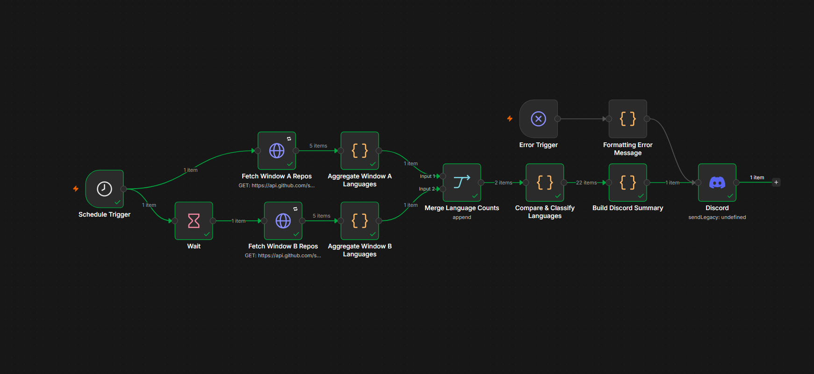

# GitHub Trending Language Tracker

An n8n workflow that runs every morning and tells you which programming languages are gaining or losing momentum on GitHub — delivered straight to Discord.

---

## What It Does

Every day at 6 AM, this workflow:

1. Fetches up to 500 recently created repos (last 30 days, 50+ stars) from the GitHub Search API
2. Fetches another 500 repos from the previous 30-day window (30–60 days ago, same filter)
3. Compares how much "market share" each language holds in each window
4. Classifies every language as **Rising**, **Declining**, **Stable**, **New**, or **Dead**
5. Sends a single formatted digest to a Discord channel

The key design decision here is using **market share** (each language as % of total repos in that window) rather than raw counts. This avoids the problem where one window having more repos than the other skews the comparison — both windows are measured on the same scale.

---

## Example Discord Output

```
📊 GitHub Language Trends — 2026-06-24

📈 Rising
TypeScript: +45% share change (8.2% → 11.9%) | 41 → 60 repos
Rust: +31% share change (3.1% → 4.1%) | 16 → 21 repos

🆕 New
Zig: 1.2% share | 0 → 6 repos

📉 Declining
PHP: -28% share change (4.5% → 3.2%) | 23 → 16 repos

💀 Dead
CoffeeScript: no recent repos | 4 → 0 repos

➡️ Stable
Python: +5% share change (22.1% → 23.2%) | 111 → 117 repos
JavaScript: -3% share change (18.4% → 17.8%) | 92 → 90 repos
```

---

## How the Classification Works

| Category | Condition |
|---|---|
| **Rising** | Market share increased by more than 20% |
| **Declining** | Market share dropped by more than 20% |
| **Stable** | Share change within ±20% |
| **New** | Present in recent window, absent in older window |
| **Dead** | Present in older window, absent in recent window |

Languages appearing fewer than 3 times combined across both windows are filtered out to avoid noise from one-off repos.

---

## Workflow Architecture

```
Schedule Trigger (6 AM daily)
    ├── Fetch Window A (last 0–30 days)      ──► Aggregate A ──┐
    └── Wait (5s) ──► Fetch Window B (30–60 days) ──► Aggregate B ──┘
                                                              │
                                                     Merge Language Counts
                                                              │
                                                  Compare & Classify Languages
                                                    (share-based normalization)
                                                              │
                                                    Build Discord Summary
                                                              │
                                                           Discord

Error Trigger ──► Formatting Error Message ──► Discord
```

The Wait node between the two fetches staggers the API calls to stay within GitHub's rate limit (10 authenticated requests/minute).

---

## Setup

### Prerequisites

- n8n instance (self-hosted or cloud)
- GitHub personal access token
- Discord webhook URL

### Steps

**1. Import the workflow**

In n8n: Workflows → Import from file → upload `GitHub_Trending_Language_Tracker.json`

**2. Set up GitHub credentials**

- Go to GitHub → Settings → Developer Settings → Personal Access Tokens → Generate new token
- No special scopes needed — public repo read is enough
- In n8n: Credentials → New → Header Auth
  - Name: `Github Bearer Token`
  - Header Name: `Authorization`
  - Header Value: `Bearer YOUR_TOKEN_HERE`

**3. Set up Discord webhook**

- In Discord: Server Settings → Integrations → Webhooks → New Webhook
- Copy the webhook URL
- In n8n: Credentials → New → Discord Webhook → paste the URL

**4. Configure the Wait node**

Open the Wait node → set Resume to "After time interval" → 5 seconds

**5. Activate**

Toggle the workflow to Active. It will run at 6 AM daily in your n8n instance's timezone.

---

## Nodes Overview

| Node | Purpose |
|---|---|
| Schedule Trigger | Fires daily at 6 AM |
| Fetch Window A Repos | GitHub API — recent 30 days, stars > 50 |
| Fetch Window B Repos | GitHub API — previous 30-day window |
| Wait | 5s stagger to respect GitHub rate limits |
| Aggregate Window A/B Languages | Counts repos per language per window |
| Merge Language Counts | Combines both aggregates for comparison |
| Compare & Classify Languages | Share-based trend classification |
| Build Discord Summary | Formats single digest message |
| Discord | Sends the message via webhook |
| Error Trigger | Catches any workflow failure |
| Formatting Error Message | Formats the error with node name + timestamp |

---

## Limitations

- GitHub Search API caps at 1,000 results per query. With `per_page=100` and `maxRequests=5`, this workflow fetches up to 500 repos per window — well within the limit.
- Results are sorted by stars descending, so the sample is biased toward high-visibility repos. This is intentional: the goal is tracking what the community is actively starring, not a random sample of all repos.
- The 20% threshold for Rising/Declining is a design choice. Languages with small absolute counts can hit this threshold from minor fluctuations — the minimum 3-occurrence filter helps reduce this but doesn't eliminate it.

---

## Tech Stack

- **n8n** — workflow automation
- **GitHub Search API** — data source
- **Discord Webhooks** — notifications
